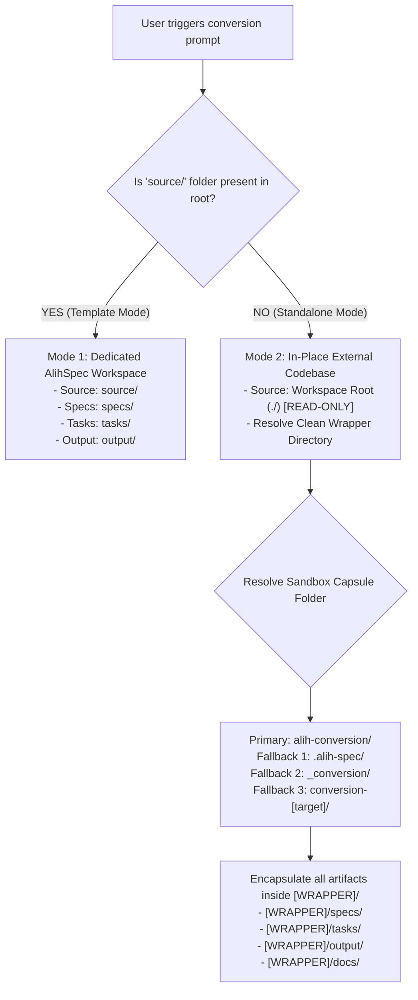
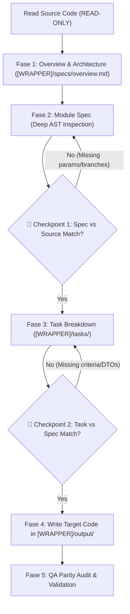

# ⚡ AlihSpec — Master Code Conversion & SDD AI Agent Skill

This skill equips AI agents with enterprise-grade capabilities to autonomously and accurately convert legacy or source codebases into target programming stacks using the **Spec-Driven Development (SDD)** methodology without *Logic Drift*, *Shallow Specifications*, or *Hidden Production Bugs*.

---

## 🗂️ Adaptive Workspace Detection & Capsule Wrapper Strategy

When activated, the AI Agent **MUST** automatically detect the workspace type to determine where to read source code and where to place conversion artifacts:



### 📦 Mode 1: Dedicated AlihSpec Template Workspace
- **Trigger**: The workspace root already contains a `source/` folder or `.sdd/config.yaml`.
- **Source**: `source/` (Strictly READ-ONLY).
- **Artifacts**: Placed at standard root paths (`specs/`, `tasks/`, `output/`, `docs/`, `evaluate/`).

### 📦 Mode 2: In-Place External / Standalone Codebase (Capsule Mode)
- **Trigger**: The skill `.agents/` folder is copied directly into a raw legacy project (e.g. an existing Laravel, Django, Express, or Spring project where code is at `./` or `./app`, `./src`).
- **Source**: Read the legacy project directly from the workspace root (`./` or specified subfolder) in **STRICT READ-ONLY MODE**. Never modify existing legacy files.
- **Anti-Pollution & Collision-Free Wrapper Strategy**:
  To prevent scattering files across the user's existing repository or colliding with existing folders (like existing `specs/` or `tasks/`), the agent **MUST encapsulate all AlihSpec artifacts inside ONE dedicated wrapper directory**:
  1. **Primary Wrapper Choice**: `alih-conversion/`
  2. **Fallback 1 (if primary exists)**: `.alih-spec/`
  3. **Fallback 2 (if fallback 1 exists)**: `_conversion/`
  4. **Fallback 3 (if fallback 2 exists)**: `conversion-[target-stack]/` (e.g. `conversion-go/`)
- **Internal Capsule Layout**:
  ```text
  [WRAPPER]/                  # e.g., alih-conversion/
  ├── specs/                  # Living specs (overview.md, architecture.md, modules/)
  ├── tasks/                  # Task queue & master dashboard (_index.md)
  ├── output/                 # 🟢 Clean Architecture target implementation
  └── docs/                   # Decisions (ADR), progress log & mapping log
  ```

---

## 🏛️ Core Principles & The 7 Golden Directives

Every time this skill is active, the AI agent **MUST STRICTLY ENFORCE** these 7 non-negotiable directives:

1. **Deep Controller AST Inspection**: Bedah baris-demi-baris seluruh query parameter (`menu`, `tab`, `filter`), percabangan `if/switch`, relasi multi-tabel database, subquery, dan validasi di controller sumber. Dilarang hanya membaca nama route atau nama model secara sekilas.
2. **Iterative Per-Module Execution**: Dilarang memproses spesifikasi atau penulisan kode massal (*bulk*) jika > 10 endpoint. Eksekusi modul demi modul secara bertahap:
   `[ 1. Spec Modul ] ➔ [ 2. Checkpoint 1 ] ➔ [ 3. Tasks Modul ] ➔ [ 4. Checkpoint 2 ] ➔ [ 5. Target Code in output/ ] ➔ [ 6. QA Parity ]`
3. **Pointer Nullability Parity**: Gunakan tipe pointer (`*int64`, `*string`, `*bool` di Go, atau `T | null` di TypeScript) untuk seluruh field DTO dan skema database yang bersifat opsional/nullable agar tidak menghasilkan *false zero-value* (`0` atau `""`) pada output JSON.
4. **Strict No Dummy Fallback**: Dilarang keras mengembalikan hardcoded dummy data (`return 5000, nil` atau `[]map{}`) pada Repository atau Handler layer. Setiap method Repository wajib menuliskan query database SQL/ORM riil yang terhubung ke skema tabel.
5. **Spec Definition of Done (DoD) Checklist**: Seluruh spesifikasi modul wajib lolos checklist DoD (Validation Parity, Branching Parity, SQL & Join Parity, Pointer Nullability) sebelum task dibuat.
6. **Checkpoint 1 (Spec vs Source Alignment)**: Validasi spesifikasi terhadap controller sumber sebelum breakdown task di `[WRAPPER]/tasks/`.
7. **Checkpoint 2 (Task vs Spec Alignment)**: Validasi kriteria task terhadap spesifikasi sebelum menulis kode di `[WRAPPER]/output/`.

---

## 🛡️ The 16 Universal Conversion Pillars (4 Quadrants)

When designing specifications, DTOs, database queries, and handlers, follow the 16 Universal Pillars:

```text
┌─────────────────────────────────────────────────────────────────────────────┐
│                16 PILAR PELAJARAN UNIVERSAL KONVERSI KODE                   │
├─────────────────────────────────────────────────────────────────────────────┤
│ 🌐 A. PROTOKOL, ROUTING & KONFIGURASI (Config & Gateway)                   │
│  1. Zero Environment Key Drift  │ Selaraskan nama key .env 100% dari sumber │
│  2. URL Builder Resiliency      │ Anti double-slash (//) pada base URL      │
│  3. Universal Context Claims    │ Ekstraksi multi-key session/JWT dinamis   │
│  4. Route Prefix Dual-Mounting  │ Dukung prefix /api dan root secara serentak│
│                                                                             │
│ 🎯 B. KONTRAK DATA, TIPE & PAYLOAD (Contract & Validation)                  │
│  5. Domain Valuation & Locale   │ Bedah helper multiplier & format currency │
│  6. Smart Query Normalization   │ Defaulting parameter sebelum validasi DTO │
│  7. Pointer Nullability Parity  │ Gunakan pointer/optional untuk field null │
│  8. Flexible Payload Coercion   │ Tangani form-urlencoded & stringed numbers│
│                                                                             │
│ 🗄️ C. DATABASE, TRANSAKSI & ACID (Database & Persistence)                   │
│  9. Strict Zero Dummy Fallback  │ Query database riil, dilarang hardcoded   │
│ 10. Explicit DB Tx Propagation  │ Oper tx context ke seluruh multi-repo     │
│ 11. Explicit ORM Table Binding  │ Anotasi TableName() & kolom eksplisit     │
│ 12. Idempotency & Safe Mutation │ Anti double-charge pada mutasi finansial  │
│                                                                             │
│ ⚡ D. RESOURCE SAFETY & OBSERVABILITY (I/O, Concurrency & SRE)              │
│ 13. Async & Shutdown Safety     │ Anti-job drop saat container restart      │
│ 14. HTTP Client Timeout Parity  │ Timeout eksplisit anti-hang network calls │
│ 15. Safe File Upload Streaming  │ Streaming I/O anti-RAM OOM pada upload    │
│ 16. Structured Observability    │ Structured JSON logging & Trace/Request ID│
└─────────────────────────────────────────────────────────────────────────────┘
```

---

## 🧭 The 5-Phase Conversion Lifecycle



### 📋 Fase 1: Analisis Menyeluruh & Arsitektur Global
1. Bedah codebase sumber untuk memetakan seluruh modul bisnis, daftar endpoint/rute, dependensi package, dan schema database.
2. Tuliskan ringkasan arsitektur ke `[WRAPPER]/specs/overview.md` dan `[WRAPPER]/specs/architecture.md`.

### 📋 Fase 2: Spesifikasi Modul Detail (Deep AST Inspection)
1. Tulis spesifikasi modul di `[WRAPPER]/specs/modules/[nama-modul].md`.
2. Cantumkan:
   - **DTO Request & Response**: Wajib mencantumkan seluruh query param (`menu`, `tab`, `filter`, `limit`, `offset`) dan menggunakan pointer untuk field nullable.
   - **Branching Matrix**: Petakan seluruh kombinasi kondisi `if/switch` dari controller sumber.
   - **SQL & Query Spec**: Catat nama tabel asli, klausa JOIN, WHERE, GROUP BY, dan Locking.
   - **Definition of Done (DoD) Checklist**.
3. **Eksekusi Checkpoint 1**: Cocokkan spesifikasi terhadap controller sumber line-by-line.

### 📋 Fase 3: Pembuatan Task Atomik
1. Buat berkas task di `[WRAPPER]/tasks/` (misal: `task-001-dto.md`, `task-002-repo.md`, dst.).
2. Cantumkan Acceptance Criteria teknis, skenario pengujian, dan dependensi task.
3. Daftarkan dan update progress di `[WRAPPER]/tasks/_index.md`.
4. **Eksekusi Checkpoint 2**: Validasi keselarasan task terhadap spesifikasi sebelum menulis kode.

### 📋 Fase 4: Penulisan Kode Target di `[WRAPPER]/output/` (Clean Architecture)
1. Seluruh implementasi kode target ditulis secara eksklusif di dalam folder `[WRAPPER]/output/`.
2. Ikuti Clean Architecture satu arah:
   `Handler (HTTP Delivery) ➔ Service / UseCase (Business Logic) ➔ Repository (Real SQL/ORM Queries) ➔ Domain / Entities`
3. **Pantangan Arsitektur**:
   - Dilarang menaruh business logic di Handler.
   - Dilarang mengakses database langsung di Handler.
   - Dilarang mengembalikan dummy mock data di Repository.
   - Seluruh mutasi multi-tabel dalam satu usecase wajib dioper di dalam satu transaksi database (`tx`).

### 📋 Fase 5: QA Parity Audit & Validasi Integritas
1. Jalankan unit test dan integration test terhadap seluruh usecase.
2. Verifikasi terhadap checklist mutu (DateTime, Currency `int64`, Pagination envelope, 422 error object, Soft deletes, JWT claims, Empty states).
3. Tandai task selesai `[x]` di `[WRAPPER]/tasks/_index.md` dan catat milestone di `[WRAPPER]/docs/progress.md`.

---

## 📚 Skill References Directory

When deep contextual guidance is needed, consult the following bundled reference files:
- [16 Universal Pillars Reference](./references/16-pillars-cheatsheet.md)
- [8 Critical Quality Standards](./references/8-quality-standards.md)
- [Cross-Stack Pattern Mappings Catalog](./references/pattern-mappings-catalog.md)
- [Deep Controller AST Inspection Guide](./references/ast-inspection-guide.md)
- [Dual-Validation Checkpoints Protocol](./references/dual-checkpoints.md)

---

## 📋 Scaffolding Resource Templates

Use the following ready-to-use template files when creating SDD artifacts in any project:
- **Module Spec Template**: [`resources/templates/spec-module.md`](./resources/templates/spec-module.md) (with DoD Checklist & Branching Matrix)
- **Atomic Task Template**: [`resources/templates/task.md`](./resources/templates/task.md) (with Technical Acceptance Criteria)
- **QA Parity Checklist Template**: [`resources/templates/qa-checklist.md`](./resources/templates/qa-checklist.md) (Comprehensive post-conversion validation)

