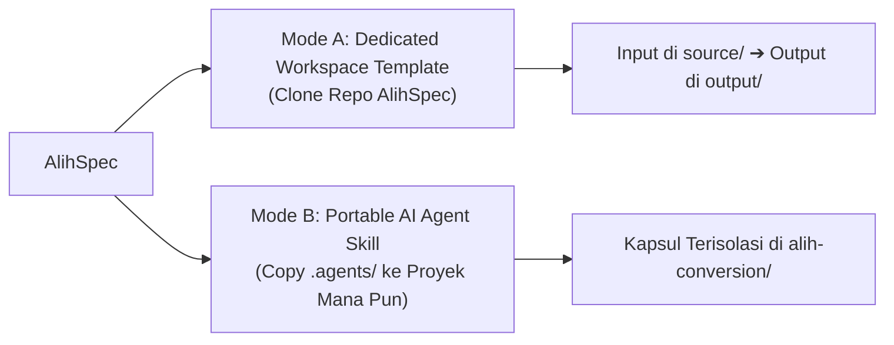

# ⚡ AlihSpec — Spec-Driven Project Conversion Framework

<p align="center">
  
  
  
  
  
</p>

> **Alihkan codebase ke bahasa apa pun dengan spesifikasi hidup & zero logic drift.**  
> *Shift any codebase across stacks through living specs, dual checkpoints, and AST-level precision.*
>
> Framework sistematis untuk mengonversi proyek perangkat lunak dari satu bahasa/framework ke bahasa/framework lain menggunakan metodologi **Spec-Driven Development (SDD)**, guardrails anti-shallow spec, dan AI-powered coding agents.

---

## 🌟 Mengapa Menggunakan AlihSpec?

- ⚡ **~70% Lebih Cepat (~3x Lipat)**: Memangkas siklus *trial-and-error* dan mengeliminasi 75% waktu debugging pasca-generate ([Lihat Benchmark Efisiensi](./docs/efficiency-benchmark.md)).
- 🛡️ **Zero Logic Drift & Anti-Shallow Specs**: Aturan bisnis, query parameters, percabangan `if/switch`, dan relasi database terkunci di `specs/` sebelum coding dimulai ([Baca Panduan Evaluasi & Studi Kasus](./evaluate/framework-evaluation.md)).
- 🛑 **Dual Validation Checkpoints**: Verifikasi silang otomatis (Checkpoint 1: Spec vs Source, Checkpoint 2: Task vs Spec) sebelum kode ditulis.
- 🚫 **Strict No Dummy Fallback**: Menjamin 100% query database riil di layer Repository tanpa hardcoded mock/fake values.
- 🤖 **Multi-IDE & AI Native**: Dilengkapi instruksi guardrails bawaan untuk **Antigravity, Cursor, Kiro, Copilot, Windsurf, Claude Code**, dan lainnya.
- 📦 **6 Presets Bawaan + Custom Engine**: Dukungan siap pakai untuk Laravel, Go, NestJS, FastAPI, Django, Rails, Spring Boot, dan custom stack.
- 🟣 **Starter Template Support**: Fleksibilitas menggunakan boilerplate target pilihan Anda via `reference-target/`.

---

## 📌 Apa itu SDD (Spec-Driven Development)?

**Spec-Driven Development** berarti merumuskan *spesifikasi hidup terlebih dahulu*, memvalidasinya terhadap source code, baru mengimplementasikan kodenya lapis demi lapis (*layer-by-layer*).

Dalam konteks konversi proyek, SDD mendefinisikan:
1. **Deep AST Inspection**: Membedah seluruh parameter query, percabangan respon, dan relasi tabel dari controller sumber baris-demi-baris.
2. **Arsitektur & Pattern Mapping**: Pemetaan konsep bahasa sumber ➔ bahasa target (misal: *Eloquent ➔ GORM*, *FormRequest ➔ DTO*, *Middleware ➔ Interceptors*).
3. **Standar Penerimaan (*Acceptance Criteria*)**: Kontrak JSON, pointer nullability parity, dan aturan bisnis yang harus dipenuhi oleh AI tanpa kompromi.

---

## 🚨 7 Golden Directives for AI Agents (MANDATORY)

Setiap Agent AI yang mengeksekusi konversi di AlihSpec **wajib** mematuhi 7 aturan utama berikut:

| # | Aturan Emas | Fokus Utama |
|---|---|---|
| 1️⃣ | **Deep Controller AST Inspection** | Bedah baris-demi-baris seluruh query param (`menu`, `tab`, `filter`), percabangan `if/switch`, relasi database, subquery, dan validasi di controller sumber. |
| 2️⃣ | **Iterative Per-Module Execution** | Dilarang memproses spesifikasi massal (*bulk*) jika > 10 endpoint. Eksekusi modul demi modul secara bertahap. |
| 3️⃣ | **Pointer Nullability Parity** | Gunakan tipe pointer (`*int64`, `*string`, `*bool`) untuk field opsional/nullable di Go/TypeScript agar tidak menghasilkan zero-value palsu (`0` atau `""`) di JSON. |
| 4️⃣ | **Strict No Dummy Fallback** | Dilarang keras mengembalikan hardcoded dummy data (`return 5000, nil` atau `[]map{}`) pada Repository atau Handler. |
| 5️⃣ | **Spec Definition of Done (DoD)** | Seluruh spesifikasi modul wajib lolos checklist DoD (Validation, Branching, SQL & Join, Pointer Nullability) sebelum task dibuat. |
| 6️⃣ | **Checkpoint 1: Spec vs Source Alignment** | Verifikasi silang spesifikasi terhadap controller sumber sebelum breakdown task. |
| 7️⃣ | **Checkpoint 2: Task vs Spec Alignment** | Verifikasi silang kriteria task terhadap spesifikasi sebelum menulis kode di `output/`. |

---

## 💎 8 Standar Mutu Kritis Enterprise

AlihSpec menerapkan 8 standar presisi enterprise untuk mencegah bug laten di produksi:

1. 🕒 **DateTime & Timezone Parity**: Format serialisasi tanggal (`YYYY-MM-DD HH:mm:ss` / ISO 8601) dan timezone wajib identik dengan API sumber.
2. 💰 **Currency & Numeric Precision**: Dilarang menggunakan `float64` untuk mata uang/koin/poin; wajib gunakan `int64` (basis sen terkecil) atau exact decimal.
3. 📑 **Pagination Envelope Parity**: Metadata pagination (`current_page`, `from`, `last_page`, `per_page`, `total`) dan perhitungan offset `(page-1)*per_page` harus 1:1 presisi.
4. ⚠️ **Validation Error Envelope Parity**: Format error HTTP 422 berupa Object of String Arrays `{"errors": {"field": ["msg"]}}`.
5. 🔒 **Concurrency & Row-Level Locking**: Mutasi saldo, kuota, atau stok wajib menggunakan transaksi dan *Row-Level Locking* (`SELECT ... FOR UPDATE`).
6. 🗑️ **Soft Delete Leakage Prevention**: Query manual JOIN atau Raw SQL wajib menyertakan `AND [table].deleted_at IS NULL`.
7. 🔑 **JWT Claims Key Parity**: Key payload token JWT (`sub`, `uid`, `user_id`, `role`) wajib konsisten dengan sistem autentikasi sumber.
8. 🛡️ **Empty State Contract**: Koleksi list kosong wajib mengembalikan array kosong `[]` (bukan `null`), dan entitas tunggal tidak ditemukan mengembalikan HTTP 404 / `null`.

---

## 📚 Landasan Teori & Standar Industri yang Dirujuk

Seluruh 7 Direktif, 16 Pilar Universal, dan 8 Standar Mutu di AlihSpec diturunkan dari standar internasional dan literatur rekayasa perangkat lunak terkemuka ([Baca Rujukan Lengkap di `evaluate/framework-evaluation.md`](./evaluate/framework-evaluation.md)):
- 🏛️ **Pola Arsitektur**: *Clean Architecture* (Robert C. Martin), *Patterns of Enterprise Application Architecture & Strangler Fig Pattern* (Martin Fowler).
- 🌐 **Protokol Web & API**: *IETF RFC 7519* (JWT Claims), *RFC 3339 / ISO 8601* (DateTime/Timezone), *RFC 7807 & 9110* (HTTP Status & Error Payloads), *RFC 3986* (URI Syntax).
- 🗄️ **Integritas Database**: *ISO/IEC 9075 SQL Standard*, *ACID Transaction Model & Pessimistic Row-Level Locking (`SELECT ... FOR UPDATE`)*.
- ⚙️ **Metodologi Modern**: *The Twelve-Factor App Methodology* (Strict Config Parity & Graceful Shutdown), *The Go Programming Language Specification*, dan *IEEE / ISO/IEC 25010 Software Quality Model*.
- 🔬 **Studi Kasus Empiris**: Post-mortem audit konversi sistem monolitik enterprise (Laravel Eloquent ➔ Go Fiber Clean Architecture).

---

## 🔄 Workflow Konversi 5 Fase (Dual Checkpoints)

```
[Fase 1] ➔ Deep Source Inspection (Bedah baris-demi-baris) ➔ specs/overview.md
[Fase 2] ➔ Tulis Spesifikasi Modul di specs/modules/[module].md (DoD Checklist)
              ↳ 🛑 CHECKPOINT 1: Spec vs Source Cross-Validation
[Fase 3] ➔ Buat Task Breakdown di tasks/ (Layer-by-Layer)
              ↳ 🛑 CHECKPOINT 2: Task vs Spec Alignment
[Fase 4] ➔ Eksekusi Koding di output/ (DTO ➔ Domain ➔ Repo ➔ Service ➔ Handler)
[Fase 5] ➔ Testing, Integritas Framework & QA Audit (100% Zero Failure)
```

---

## 🗂️ Struktur Folder Lengkap

```
alih-spec/
│
├── .agents/              # 🧠 Native AI Agent Skills & Customization
│   └── skills/
│       └── alih-spec/    # Skill AlihSpec bawaan (SKILL.md, 16 pillars, AST guide)
│
├── .sdd/                 # ⚙️ Konfigurasi framework, active mapping & presets
│   ├── config.yaml       # File konfigurasi utama proyek konversi
│   ├── mapping/          # Aturan pemetaan pola (patterns.md, conventions.md)
│   └── presets/          # Katalog preset bawaan (laravel-to-go, django-to-fastapi, dll.)
│
├── source/               # 🔵 Proyek asli (READ-ONLY reference — jangan dimodifikasi)
├── reference-target/     # 🟣 Template starter target pilihan (OPSIONAL, READ-ONLY)
│
├── specs/                # 📋 Single Source of Truth (Spesifikasi Arsitektur & Bisnis)
│   ├── overview.md       # Ringkasan domain, modul, routes, & relasi database
│   ├── architecture.md   # Pola arsitektur target, struktur layer & folder output
│   ├── data-models/      # Dokumentasi skema tabel & relasi DB (schema.md)
│   ├── modules/          # Spesifikasi per-modul detail dengan DoD & Branching Matrix
│   └── api-contracts/    # Kontrak API OpenAPI / Swagger (openapi.yaml)
│
├── tasks/                # ✅ Antrean pengerjaan modular & master progress index
│   ├── _index.md         # Dashboard master status progress seluruh task
│   ├── phase-1-foundation/   # Task setup scaffold, DB layer & auth
│   ├── phase-2-core-modules/ # Task implementasi modul bisnis utama
│   └── phase-3-integration/  # Task router gateway, E2E testing & polish
│
├── context/              # 🧠 Context Engine & Guardrails untuk AI Agent
│   ├── AGENTS.md         # Instruksi master wajib baca untuk seluruh AI agent
│   ├── RULES.md          # Registry aturan bisnis & architectural guardrails
│   ├── conventions.md    # Standar konvensi penamaan & koding bahasa target
│   ├── tech-stack.md     # Spesifikasi detail stack & dependency target
│   ├── VIBE.md           # Bank 13 prompt presisi tinggi untuk full vibe coding
│   ├── qa-checklist.md   # Checklist audit mutu sebelum rilis
│   └── glossary.md       # Kamus istilah & padanan konsep lintas bahasa
│
├── evaluate/             # 🔬 Pusat Evaluasi & Pelajaran Konversi Lintas Bahasa
│   ├── README.md                    # Panduan tata kelola evaluasi & case studies
│   └── framework-evaluation.md      # Master context: 16 pilar universal & guardrails
│
├── output/               # 🟢 Hasil konversi murni (seluruh kode target ditulis di sini)
├── docs/                 # 📚 Audit trail, Architecture Decisions (ADR) & Benchmark
│   ├── START-HERE.md     # Panduan orientasi memilih jalur pengerjaan
│   ├── efficiency-benchmark.md # Metrik kuantitatif efisiensi & scorecard KPI
│   ├── decisions.md      # Catatan Architecture Decision Records (ADR)
│   ├── progress.md       # Log progres harian & milestone
│   ├── mapping-log.md    # Log pencatatan deviasi teknis sumber ➔ target
│   ├── changelog.md      # Catatan riwayat versi
│   ├── guide-vibe-coding.md # Panduan lengkap alur Vibe Coding
│   └── guide-manual.md   # Panduan lengkap alur Manual / Semi-Auto
│
└── scripts/              # 🛠️ CLI automation suite ('alih')
```

---

## 🚀 Dua Cara Menggunakan AlihSpec

AlihSpec dirancang fleksibel dengan **2 mode penggunaan**:



---

### 1️⃣ Mode A: Dedicated Workspace Template (Alur Standar)
> Cocok jika Anda ingin workspace migrasi yang bersih dan terisolasi secara menyeluruh sejak awal.

1. **Clone Template**:
   ```bash
   git clone https://github.com/hanifalkauni/alih-spec.git my-conversion
   cd my-conversion
   ```
2. **Salin Kode Sumber**: Salin kode proyek lama Anda ke dalam folder `source/` *(opsional: starter target di `reference-target/`)*.
3. **Inisialisasi**: Jalankan `.\scripts\alih.ps1 init` (atau `bash scripts/alih.sh init`).
4. **Pilih Jalur Kerja**:
   - 🤖 **[Vibe Coding Guide](./docs/guide-vibe-coding.md)**: Gunakan prompt queue otomatis.
   - ✍️ **[Manual Guide](./docs/guide-manual.md)**: Kontrol arsitektur & spec writing terperinci.
   - ⚡ **[Prompt Bank (VIBE.md)](./context/VIBE.md)**: Bank 13 prompt enterprise siap pakai.

---

### 2️⃣ Mode B: Portable AI Agent Skill (`.agents/skills/alih-spec/`)
> Cocok jika Anda ingin **langsung mengonversi di dalam repository proyek lama** tanpa perlu memindahkan source code atau meng-clone seluruh template!

1. **Pasang Skill**: Cukup salin folder [`.agents/`](./.agents/skills/alih-spec/SKILL.md) ke dalam root folder proyek lama Anda (atau pasang di global config AI IDE Anda `~/.gemini/config/skills/`).
2. **Buka Proyek di AI IDE** (Antigravity IDE, Cursor, Claude Code, Windsurf, dll.).
3. **Kirimkan Prompt Konversi ke AI Chat**:
   ```markdown
   Tolong konversikan modul auth dan order dari proyek ini ke Go Fiber Clean Architecture menggunakan skill alih-spec.
   ```
4. 🛡️ **Sandbox Capsule Strategy (Zero Root Pollution)**:
   - AI otomatis membaca kode lama Anda secara **STRICT READ-ONLY**.
   - AI **TIDAK AKAN MENGOTORI** root folder Anda. Seluruh spesifikasi, task, dan output kode target akan dibungkus rapi di dalam satu folder sandbox terisolasi:
     ```text
     my-laravel-app/            # 🔵 Proyek Asli Anda (Aman & Tidak Tersentuh)
     ├── app/
     ├── routes/
     ├── database/
     ├── .agents/skills/alih-spec/
     │
     └── alih-conversion/       # 📦 Folder Kapsul Terisolasi
         ├── specs/             # Living specs & API contracts
         ├── tasks/             # Antrean task & progress (_index.md)
         ├── output/            # 🟢 Kode target Clean Architecture
         └── docs/              # Catatan ADR & mapping log
     ```
   - *Nama Cadangan Fallback*: Jika `alih-conversion/` sudah ada di repo Anda, AI otomatis menggunakan nama alternatif: `.alih-spec/`, `_conversion/`, atau `conversion-[target]/`.

---

## 📦 Presets Bawaan Siap Pakai (`.sdd/presets/`)

| Preset | Stack Asal | Stack Target | Arsitektur Target |
|---|---|---|---|
| `laravel-to-go` | PHP (Laravel) | Go (Gin / Fiber + GORM) | Clean Architecture (Layered) |
| `laravel-to-nestjs` | PHP (Laravel) | TypeScript (NestJS + Prisma/TypeORM) | Modular Architecture |
| `laravel-to-fastapi` | PHP (Laravel) | Python (FastAPI + SQLAlchemy) | Async Clean Architecture |
| `codeigniter-to-go` | PHP (CodeIgniter) | Go (Gin / Fiber + GORM) | Clean Architecture |
| `codeigniter-to-laravel` | PHP (CodeIgniter) | PHP (Laravel Eloquent) | Modern MVC Architecture |
| `php-native-to-laravel` | PHP (Native / Procedural) | PHP (Laravel Eloquent) | Modern MVC Architecture |
| `django-to-fastapi` | Python (Django) | Python (FastAPI + SQLAlchemy) | Async Clean Architecture |
| `rails-to-nodejs` | Ruby (Rails) | Node.js (Express + Prisma) | Layered MVC / Service |
| `spring-to-go` | Java (Spring Boot) | Go (Fiber / Gin + GORM) | Clean Architecture |
| `express-to-go` | JavaScript (Express) | Go (Gin / Fiber + GORM) | Clean Architecture |
| `express-to-nestjs` | JavaScript (Express) | TypeScript (NestJS) | Enterprise Modular |
| `_custom-template` | *Bahasa Apapun* | *Bahasa Apapun* | [Panduan Custom Preset](./.sdd/presets/CUSTOM-PRESET-GUIDE.md) |

---

## 🛠️ CLI Automation Suite (`alih`)

Framework ini dilengkapi CLI bawaan di folder `scripts/`:

| Perintah Terminal | Kapan Dijalankan? | Fungsi |
|---|---|---|
| `.\scripts\alih.ps1 init`<br>`bash scripts/alih.sh init` | **Awal Proyek (Fase 0)** | Inisialisasi konfigurasi, pair konversi & auto-apply preset |
| `.\scripts\alih.ps1 status`<br>`bash scripts/alih.sh status` | **Kapan saja saat pengerjaan** | Dashboard progress bar visual, persentase task & rekomendasi pengerjaan |
| `.\scripts\alih.ps1 validate`<br>`bash scripts/alih.sh validate` | **Sebelum coding & saat QA (Fase 3 & 5)** | Validasi integritas file, verifikasi broken link & coverage task |
| `.\scripts\alih.ps1 help`<br>`bash scripts/alih.sh help` | **Kapan saja** | Menampilkan bantuan perintah CLI |

---

## 🧠 Instruksi untuk AI Agent

Jika Anda adalah AI Coding Assistant (**Antigravity, Cursor, Kiro, Copilot, Windsurf, Claude Code, Cline**) yang membaca workspace ini:
1. 👉 **Wajib membaca [`context/AGENTS.md`](./context/AGENTS.md)** terlebih dahulu sebelum menulis atau mengubah kode apa pun.
2. 🔬 **Pahami 16 Pilar Universal & 7 Direktif di [`evaluate/framework-evaluation.md`](./evaluate/framework-evaluation.md)** untuk memastikan paritas arsitektural dan mencegah *shallow specs*.
3. 📜 **Cek [`context/RULES.md`](./context/RULES.md)** untuk memastikan tidak ada aturan bisnis atau batasan arsitektur yang terlewat.

---

## 📚 Peta Dokumentasi & Audit Trail

| Berkas | Kapan Harus Diakses? | Fungsi Utama |
|---|---|---|
| [`docs/START-HERE.md`](./docs/START-HERE.md) | Orientasi awal | Panduan memilih jalur kerja (Vibe vs Manual vs Hybrid) |
| [`evaluate/framework-evaluation.md`](./evaluate/framework-evaluation.md) | Evaluasi Lintas Bahasa | Master Guide: 16 Pilar Universal, 7 Direktif, Studi Kasus, & 8 Standar Mutu |
| [`evaluate/README.md`](./evaluate/README.md) | Tata Kelola Evaluasi | Panduan struktur dan penambahan studi kasus evaluasi baru |
| [`docs/prompt-queue/`](./docs/prompt-queue/README.md) | Eksekusi Vibe Coding | Antrean prompt terpisah per modul (nama modul & controller terisi otomatis) |
| [`context/VIBE.md`](./context/VIBE.md) | Bank Prompt Vibe | Bank 13 prompt presisi berstandar enterprise siap pakai |
| [`context/RULES.md`](./context/RULES.md) | Validasi Bisnis | Single registry seluruh aturan bisnis & guardrails arsitektur |
| [`context/qa-checklist.md`](./context/qa-checklist.md) | QA & Rilis | Checklist verifikasi kualitas komprehensif sebelum rilis |
| [`docs/efficiency-benchmark.md`](./docs/efficiency-benchmark.md) | Evaluasi KPI | Analisis efisiensi waktu (~70%), penghematan token & scorecard |
| [`docs/decisions.md`](./docs/decisions.md) | Keputusan Arsitektur | Catatan Architecture Decision Records (ADR) |
| [`docs/progress.md`](./docs/progress.md) | Handover / Pause Sesi | Log pencapaian milestone & status terkini sesi pengerjaan |
| [`docs/mapping-log.md`](./docs/mapping-log.md) | Deviasi Teknis | Dokumentasi fitur sumber yang tidak memiliki padanan 1:1 |
| [`docs/changelog.md`](./docs/changelog.md) | Rilis Modul | Riwayat penambahan, perubahan, dan perbaikan bug |
| [`CONTRIBUTING.md`](./CONTRIBUTING.md) | Komunitas | Panduan kontribusi komunitas & pembuatan preset baru |

---

## 📄 Lisensi

Didistribusikan di bawah lisensi open-source **MIT License**. Lihat [`LICENSE`](./LICENSE) untuk informasi lebih lanjut.

---

<p align="center">
  <b>AlihSpec v1.0.0</b> • Dibuat untuk ekosistem AI Coding modern berpresisi enterprise 🚀
</p>


