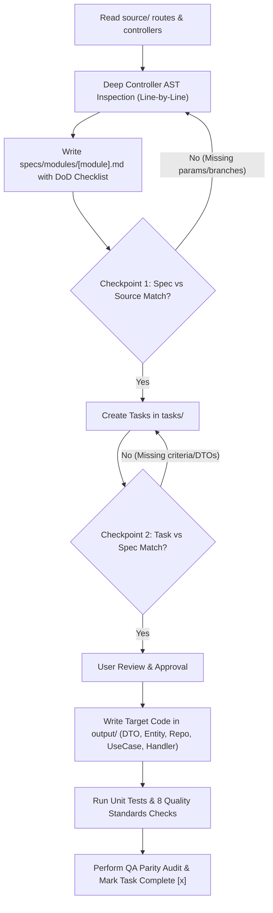

# 📖 Master Reference Guide: Evaluasi & Standar Mutu Presisi Konversi Kode (AlihSpec SDD)

> 📌 **Petunjuk Operasional & Standardisasi Mutu Agent AI (AlihSpec Framework)**  
> Berkas ini disusun sebagai acuan utama bagi seluruh Agent AI dan Software Engineer yang mengeksekusi proyek konversi arsitektur perangkat lunak lintas bahasa menggunakan metodologi **Spec-Driven Development (SDD)** pada AlihSpec.

---

## 🎯 Tujuan Dokumen Ini

Dokumen ini dibuat untuk mengeliminasi **Logic Drift**, **Spesifikasi Dangkal (*Shallow Specs*)**, dan **Bug Laten (*Hidden Production Bugs*)** saat mengonversi kode dari aplikasi sumber (seperti Laravel, Django, Express, Rails, Spring) ke aplikasi target (seperti Go Clean Architecture, NestJS, FastAPI, dll.).

---

## 🔍 1. Studi Kasus: Mengapa Spesifikasi Dangkal Berbahaya?

### 🔬 Contoh Kasus Nyata (Cita Module `currentCoin`)
Pada pengujian awal konversi modul Cita dari Laravel ke Go Fiber, spesifikasi di `specs/modules/cita.md` hanya mencatat DTO sederhana:

```go
// ❌ CONTOH SPESIFIKASI TERLALU DANGKAL (DILARANG)
type CitaCurrentCoinResponse struct {
	CurrentCoin int64 `json:"current_coin"`
}
```

Padahal pada controller sumber Laravel (`CoinController.php`), fungsi `currentCoin()` memiliki 3 percabangan bisnis kompleks:
1. **Base Mode**: Mengembalikan `current_coin` dan `current_valuation_coin`.
2. **Mode `menu=mission`**: Mengkueri 5 tabel (`tsm`, `tsmt`, `dcr`, `audiences`, `submissions`, `dte_automations`) untuk menghitung akumulasi `potential_coin`.
3. **Mode `menu=history_coin`**: Mengelompokkan data berdasarkan `coin_expiry_date` terdekat untuk mengembalikan `nearest_coin_expiry_date`, `nearest_coin_expiry_date_formatted`, dan `sum_coin_nearest_coin_expiry_date`.

> **Pelajaran Kunci bagi Agent**: Menghasilkan spesifikasi ringkas tanpa membedah isi controller sumber akan menyebabkan *missed business rules* dan memaksa pembuatan kode *fallback dummy* yang melanggar kontrak API.

---

## 🚨 2. Tujuh Aturan Emas Agent AI (7 Golden Directives)

Setiap Agent AI yang mengeksekusi AlihSpec SDD **WAJIB** mematuhi 7 aturan utama berikut:

### 1️⃣ Aturan Deep Controller AST Inspection (Bedah Baris-demi-Baris)
- Jangan hanya membaca nama fungsi, route, atau nama model secara sekilas.
- Agent **WAJIB** membaca seluruh isi fungsi controller sumber baris-demi-baris:
  - Membaca semua aturan `request()->validate()` dan query parameter (`menu`, `tab`, `filter`, `limit`, `offset`, `search`).
  - Membaca semua percabangan `if ($param == ...)` / `switch-case` internal.
  - Membaca semua Join tabel, Group By, SelectRaw, Subquery, dan Having pada database.

### 2️⃣ Aturan Iterative Per-Module Execution (Eksekusi Bertahap per Modul)
- **DILARANG KERAS** memproses spesifikasi seluruh modul sekaligus (*bulk processing*) jika jumlah endpoint > 10.
- Eksekusi wajib dilakukan secara bertahap (Iteratif) per modul:
  `[ 1. Spec Modul A ] ➔ [ 2. Validate Spec vs Source ] ➔ [ 3. Tasks Modul A ] ➔ [ 4. Code Modul A ] ➔ [ 5. QA Modul A ]`

### 3️⃣ Aturan Pointer Nullability Parity (Pointer pada Struct Target)
- Di bahasa dinamis seperti PHP/JS/Python, bidang opsional bernilai `null`.
- Di Go/TypeScript/Rust, gunakan tipe **pointer** (`*int64`, `*string`, `*bool`) atau union (`T | null`) untuk seluruh bidang JSON opsional pada DTO target. Ini memastikan nilai `nil` tidak muncul secara salah sebagai default zero-value (`0` atau `""`) di output JSON.

### 4️⃣ Aturan Strict No Dummy Fallback (Dilarang Hardcoded Dummy Data)
- **DILARANG KERAS** mengembalikan *hardcoded dummy data* (seperti `return 5000, nil` atau `[]map{}`) pada layer Repository atau Handler.
- Setiap method pada layer Repository wajib menuliskan query database riil yang terhubung ke database.

### 5️⃣ Aturan Spec Definition of Done (DoD) Checklist
Sebelum berkas `specs/modules/[module].md` dinyatakan **SELESAI**, Agent WAJIB memeriksa checklist DoD:
- [ ] **Validation & Query Parity**: Semua aturan validasi dan query parameters dicatat di DTO.
- [ ] **Branching Parity**: Semua percabangan logika respon dicatat di UseCase & DTO.
- [ ] **Query SQL Parity**: Semua nama tabel asli, nama kolom asli, dan klausa JOIN/GROUP BY dicatat di Repository Spec.
- [ ] **Pointer Nullability Parity**: Semua bidang opsional menggunakan tipe pointer.

### 6️⃣ Aturan Checkpoint 1: Spec vs Source Alignment
Sebelum pembuatan task breakdown di `tasks/`, Agent **WAJIB** mengeksekusi verifikasi silang:
- Bandingkan daftar fungsi controller di `source/` dengan file `specs/modules/[module].md`.
- Pastikan semua query params, validation error codes, dan skema JSON di `specs/` persis dengan logika di `source/`.

### 7️⃣ Aturan Checkpoint 2: Task vs Spec Alignment
Sebelum eksekusi penulisan kode di `output/`, Agent **WAJIB** mengeksekusi validasi keselarasan tugas:
- Pastikan berkas `tasks/[phase]/task-[xxx]-[module].md` memuat semua DTO struct, interface method, dan acceptance criteria dari spesifikasi.
- Pastikan task urutan dasar (Foundation/DB Layer) diselesaikan terlebih dahulu sebelum task Handler/UseCase.

---

## 💎 3. Delapan Standar Mutu Kritis Enterprise (8 Critical Quality Standards)

Berikut adalah 8 standar mutu yang sering terlewat dan menjadi penyebab bug di produksi pasca-konversi:

### 1. 🕒 DateTime, Timezone & Serialization Parity
- **Standar**: Format serialisasi string tanggal JSON pada target wajib identik dengan sumber (misal: `YYYY-MM-DD HH:mm:ss` pada timezone `Asia/Jakarta (+07:00)` atau ISO 8601).
- **Go Pattern**: Gunakan Custom Time type dengan `MarshalJSON()` untuk memformat `2006-01-02 15:04:05` jika frontend mengharapkan format non-RFC3339.

### 2. 💰 Currency & Numeric Precision (Anti-Floating Point Error)
- **Standar**: Nilai moneter, koin, poin, dan saldo **DILARANG** menggunakan `float32`/`float64`.
- **Target Pattern**: Gunakan `int64` (basis sen/satuan terkecil) atau library presisi desimal eksak (`shopspring/decimal` di Go, `BigDecimal` di Java, `Decimal` di Python).

### 3. 📑 Pagination Envelope & Indexing Parity (0-Index vs 1-Index)
- **Standar**: Struktur amplop paginasi wajib 100% identik dengan sumber:
  `{ "current_page": 1, "data": [...], "from": 1, "last_page": 5, "per_page": 15, "total": 67 }`.
- **Perhitungan Offset**: `offset = (page - 1) * per_page` (Page 1 = Offset 0).

### 4. ⚠️ Validation Error Envelope Parity (Object of Arrays vs String)
- **Standar**: Format respons HTTP 422 Unprocessable Entity wajib konsisten dengan format konsumsi Frontend:
  `{ "message": "The email field is required.", "errors": { "email": ["The email field is required."] } }`.

### 5. 🔒 Concurrency, Row-Level Locking & Race Conditions
- **Standar**: Setiap mutasi saldo, kuota, kupon, atau checkout stok barang wajib menggunakan transaksi dan *Row-Level Locking* (`SELECT ... FOR UPDATE`).
- **GORM Pattern**: `tx.Clauses(clause.Locking{Strength: "UPDATE"}).First(&wallet, userID)`.

### 6. 🗑️ Soft Delete Leakage pada Manual Joins & Raw SQL
- **Standar**: Pada query manual JOIN atau Raw SQL, klausa `AND [table].deleted_at IS NULL` wajib disertakan secara eksplisit agar data terhapus tidak bocor ke kalkulasi API.

### 7. 🔑 JWT Claims Key Parity & Token Extraction
- **Standar**: Nama key klaim JWT pada target wajib persis dengan token generator sumber (`sub`, `uid`, `user_id`, `role`, dll.) agar identitas user tidak berubah menjadi nol/kosong.

### 8. 🛡️ Empty State & Null Representation Contract
- **Standar**: Koleksi data kosong harus konsisten mengembalikan array kosong `[]` (bukan `null`), sedangkan objek detail yang tidak ditemukan mengembalikan HTTP 404 atau `null`.

---

## 🗺️ 4. Tabel Pemetaan Pola Query (Eloquent ➔ GORM Pattern Mapping)

| Laravel Eloquent Pattern | Go GORM Equivalent Pattern | Catatan Kunci |
|---|---|---|
| `$query->whereDate('expired_at', '>=', $today)` | `db.Where("expired_at >= ?", today)` | Gunakan format string `"YYYY-MM-DD"` |
| `$query->selectRaw('COALESCE(SUM(coin), 0) as total')` | `db.Select("COALESCE(SUM(coin), 0)").Scan(&total)` | Gunakan `.Scan()` untuk menampung agregat |
| `$query->groupBy('date')->having('total', '>', 0)` | `db.Group("date").Having("total > 0")` | Gunakan `.Group()` dan `.Having()` di GORM |
| `$query->cursorPaginate($limit)` | `db.Limit(limit).Offset(offset).Scan(&items)` | Gunakan Limit & Offset untuk pagination |
| `DB::table('users')->pluck('id')` | `db.Table("users").Pluck("id", &ids)` | Pass pointer slice `&ids` ke `.Pluck()` |
| `DB::transaction(function() { ... })` | `db.Transaction(func(tx *gorm.DB) error { ... })` | Bungkus mutasi DB dalam GORM Transaction |
| `$query->lockForUpdate()` | `db.Clauses(clause.Locking{Strength: "UPDATE"})` | Row-level locking untuk keamanan concurrency |

---

## 🧭 5. Workflow Standar dengan Dual Validation Checkpoints


