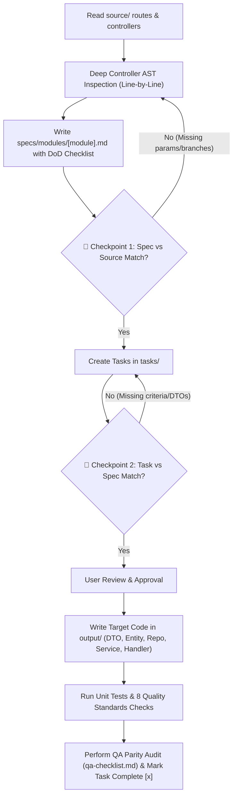

# 🔬 AlihSpec Master Context — Evaluasi Konversi & Pelajaran Lapangan Lintas Bahasa

> 📌 **Master Reference Guide: Universal Context, Lessons Learned, & Precision Standards for Multi-Stack Architecture Conversions**  
> Berkas ini menyajikan evaluasi komprehensif, analisis akar masalah riil (*root cause analysis*), **7 Golden Directives**, **16 Pilar Pelajaran Lapangan Universal**, dan **8 Standar Mutu Kritis Enterprise** yang dipelajari dari proses konversi perangkat lunak lintas bahasa.
> 
> Panduan ini dirancang **agnostik bahasa** agar menjadi acuan utama bagi seluruh Agent AI (Antigravity, Cursor, Kiro, Copilot, Claude, Windsurf, Cline) dan Software Engineer untuk proyek konversi stack apa pun (*Laravel ➔ Go, Django ➔ FastAPI, Express ➔ NestJS, Rails ➔ Spring Boot, dll.*).

---

## 🎯 1. Mengapa Dokumen Ini Sangat Penting?

Konversi antar bahasa pemrograman (*cross-stack migration*) bukan sekadar menerjemahkan sintaksis (*syntax translation*), melainkan **menjaga integritas perilaku sistem (*behavioral parity*)** di tengah perbedaan paradigma:
- **Bahasa Dinamis vs Statis**: Tipe data dinamis (PHP, Python, JS, Ruby) memiliki toleransi runtime berbeda dibandingkan tipe data statis ketat (Go, TypeScript, Rust, Java, C#).
- **Konvensi Framework Bawaan**: Tiap framework memiliki konvensi implisit (*magic behavior*) seperti prefix rute otomatis, dynamic model properties, dan handling serialisasi JSON yang berbeda.

Dokumen ini dibuat untuk mengeliminasi **Logic Drift**, **Spesifikasi Dangkal (*Shallow Specs*)**, dan **Bug Laten (*Hidden Production Bugs*)** saat mengonversi kode dari aplikasi sumber ke aplikasi target.

---

## 🔍 2. Studi Kasus Riil: Mengapa Spesifikasi Dangkal (*Shallow Specs*) Berbahaya?

### 🔬 Contoh Kasus Nyata (Cita Module `currentCoin`)
Pada pengujian awal konversi modul Cita dari Laravel ke Go Fiber, spesifikasi di `specs/modules/cita.md` hanya mencatat DTO sederhana:

```go
// ❌ CONTOH SPESIFIKASI TERLALU DANGKAL (DILARANG)
type CitaCurrentCoinResponse struct {
	CurrentCoin int64 `json:"current_coin"`
}
```

Padahal pada controller sumber Laravel (`CoinController.php`), fungsi `currentCoin()` memiliki **3 percabangan bisnis internal yang kompleks**:
1. **Base Mode**: Mengembalikan `current_coin` dan `current_valuation_coin`.
2. **Mode `menu=mission`**: Mengkueri 5 tabel (`tsm`, `tsmt`, `dcr`, `audiences`, `submissions`, `dte_automations`) untuk menghitung akumulasi `potential_coin`.
3. **Mode `menu=history_coin`**: Mengelompokkan data berdasarkan `coin_expiry_date` terdekat untuk mengembalikan `nearest_coin_expiry_date`, `nearest_coin_expiry_date_formatted`, dan `sum_coin_nearest_coin_expiry_date`.

> **Pelajaran Kunci bagi Agent**: Menghasilkan spesifikasi ringkas tanpa membedah isi controller sumber akan menyebabkan *missed business rules*, merusak kontrak API, dan memaksa pembuatan kode *fallback dummy* yang melanggar standar arsitektur.

---

## 🚨 3. Tujuh Aturan Emas Agent AI (7 Golden Directives)

Setiap Agent AI yang mengeksekusi konversi di AlihSpec **WAJIB** mematuhi 7 aturan utama berikut:

### 1️⃣ Aturan Deep Controller AST Inspection (Bedah Baris-demi-Baris)
- Jangan hanya membaca nama fungsi, route, atau nama model secara sekilas.
- Agent **WAJIB** membaca seluruh isi fungsi controller sumber baris-demi-baris:
  - Membaca semua aturan `request()->validate()` dan query parameter (`menu`, `tab`, `filter`, `limit`, `offset`, `search`).
  - Membaca semua percabangan `if ($param == ...)` / `switch-case` internal.
  - Membaca semua Join tabel, Group By, SelectRaw, Subquery, dan Having pada database.

### 2️⃣ Aturan Iterative Per-Module Execution (Eksekusi Bertahap per Modul)
- **DILARANG KERAS** memproses spesifikasi seluruh modul sekaligus (*bulk processing*) jika jumlah endpoint > 10.
- Eksekusi wajib dilakukan secara bertahap (Iteratif) per modul:
  `[ 1. Spec Modul A ] ➔ [ 2. Checkpoint 1 ] ➔ [ 3. Tasks Modul A ] ➔ [ 4. Checkpoint 2 ] ➔ [ 5. Code Modul A ] ➔ [ 6. QA Modul A ]`

### 3️⃣ Aturan Pointer Nullability Parity (Pointer pada Struct Target)
- Di bahasa dinamis seperti PHP/JS/Python, bidang opsional bernilai `null`.
- Di Go/TypeScript/Rust, gunakan tipe **pointer** (`*int64`, `*string`, `*bool`) atau union (`T | null`) untuk seluruh bidang JSON opsional pada DTO target. Ini memastikan nilai `nil` tidak muncul secara salah sebagai default zero-value (`0` atau `""`) di output JSON.

### 4️⃣ Aturan Strict No Dummy Fallback (Dilarang Hardcoded Dummy Data)
- **DILARANG KERAS** mengembalikan *hardcoded dummy data* (seperti `return 5000, nil` atau `[]map{}`) pada layer Repository atau Handler.
- Setiap method pada layer Repository wajib menuliskan query database riil yang terhubung ke skema database.

### 5️⃣ Aturan Spec Definition of Done (DoD) Checklist
Sebelum berkas `specs/modules/[module].md` dinyatakan **SELESAI**, Agent WAJIB memeriksa checklist DoD:
- [ ] **Validation & Query Parity**: Semua aturan validasi dan query parameters dicatat di DTO.
- [ ] **Branching Parity**: Semua percabangan logika respon dicatat di UseCase & DTO.
- [ ] **Query SQL Parity**: Semua nama tabel asli, nama kolom asli, dan klausa JOIN/GROUP BY dicatat di Repository Spec.
- [ ] **Pointer Nullability Parity**: Semua bidang opsional menggunakan tipe pointer.

### 6️⃣ Aturan Checkpoint 1: Spec vs Source Alignment
Sebelum pembuatan task breakdown di `tasks/`, Agent **WAJIB** mengeksekusi verifikasi silang:
- Bandingkan daftar fungsi controller di `source/` dengan file `specs/modules/[module].md`.
- Pastikan semua query params, validation error codes, dan skema JSON di `specs/` persis dengan logika di `source/`.

### 7️⃣ Aturan Checkpoint 2: Task vs Spec Alignment
Sebelum eksekusi penulisan kode di `output/`, Agent **WAJIB** mengeksekusi validasi keselarasan tugas:
- Pastikan berkas `tasks/[phase]/task-[xxx]-[module].md` memuat semua DTO struct, interface method, dan acceptance criteria dari spesifikasi.
- Pastikan task urutan dasar (Foundation/DB Layer) diselesaikan terlebih dahulu sebelum task Handler/UseCase.

---

## 🧭 Workflow Standar dengan Dual Validation Checkpoints



---

## 🛡️ 4. Enam Belas Pilar Pelajaran Lapangan Universal Konversi Kode

```text
┌─────────────────────────────────────────────────────────────────────────────┐
│                16 PILAR PELAJARAN UNIVERSAL KONVERSI KODE                   │
├─────────────────────────────────────────────────────────────────────────────┤
│ 🌐 A. PROTOKOL, ROUTING & KONFIGURASI (Config & Gateway)                   │
│  1. Zero Environment Key Drift  │ Selaraskan nama key .env 100% dari sumber │
│  2. URL Builder Resiliency      │ Anti double-slash (//) pada base URL      │
│  3. Universal Context Claims    │ Ekstraksi multi-key session/JWT dinamis   │
│  4. Route Prefix Dual-Mounting  │ Dukung prefix /api dan root secara serentak│
│                                                                             │
│ 🎯 B. KONTRAK DATA, TIPE & PAYLOAD (Contract & Validation)                  │
│  5. Domain Valuation & Locale   │ Bedah helper multiplier & format currency │
│  6. Smart Query Normalization   │ Defaulting parameter sebelum validasi DTO │
│  7. Pointer Nullability Parity  │ Gunakan pointer/optional untuk field null │
│  8. Flexible Payload Coercion   │ Tangani form-urlencoded & stringed numbers│
│                                                                             │
│ 🗄️ C. DATABASE, TRANSAKSI & ACID (Database & Persistence)                   │
│  9. Strict Zero Dummy Fallback  │ Query database riil, dilarang hardcoded   │
│ 10. Explicit DB Tx Propagation  │ Oper tx context ke seluruh multi-repo     │
│ 11. Explicit ORM Table Binding  │ Anotasi TableName() & kolom eksplisit     │
│ 12. Idempotency & Safe Mutation │ Anti double-charge pada mutasi finansial  │
│                                                                             │
│ ⚡ D. RESOURCE SAFETY & OBSERVABILITY (I/O, Concurrency & SRE)              │
│ 13. Async & Shutdown Safety     │ Anti-job drop saat container restart      │
│ 14. HTTP Client Timeout Parity  │ Timeout eksplisit anti-hang network calls │
│ 15. Safe File Upload Streaming  │ Streaming I/O anti-RAM OOM pada upload    │
│ 16. Structured Observability    │ Structured JSON logging & Trace/Request ID│
└─────────────────────────────────────────────────────────────────────────────┘
```

---

### 🌐 KUADRAN A: PROTOKOL, ROUTING & KONFIGURASI

#### 1️⃣ Pilar 1: Zero Environment Key Drift (Paritas Konfigurasi Lingkungan)
- **Problem**: Starter template target biasanya memiliki konvensi default (`MYSQL_PORT`, `REDIS_HOST`), sedangkan proyek sumber menggunakan variabel domain kustom (`DB_COIN_PORT`, `SERVICE_AUTH_URI`). Jika target memaksakan nama baru, proses deploy produksi akan gagal.
- **Prinsip**:
  1. Dilarang mengubah nama variabel environment dari proyek sumber.
  2. Parser konfigurasi target wajib memetakan key sumber 1:1.

#### 2️⃣ Pilar 2: URL Builder Resiliency (Normalisasi URI & Anti-Double Slash)
- **Problem**: Base URL pada `.env` sering memiliki trailing slash (`https://auth.example.com/`). Saat digabungkan dengan `/api/v1/verify`, URL menjadi `https://auth.example.com//api/v1/verify` (double slash `//`), yang memicu `404 Not Found`.
- **Prinsip**:
  1. Selalu gunakan helper pembersih URL (*safe URL joiner*) yang memotong trailing slash dari base URL dan leading slash dari relative path:
     ```go
     func JoinURL(baseURL string, paths ...string) string {
         base := strings.TrimRight(baseURL, "/")
         var cleanPaths []string
         for _, p := range paths {
             clean := strings.Trim(p, "/")
             if clean != "" {
                 cleanPaths = append(cleanPaths, clean)
             }
         }
         return base + "/" + strings.Join(cleanPaths, "/")
     }
     ```

#### 3️⃣ Pilar 3: Universal Context Claims (Ekstraksi Multi-Key Sesi & Token JWT)
- **Problem**: Model user pada framework dinamis memiliki properti domain (`$user->cita_business_id`, `$user->store_id`, `req.user.tenant_id`). Jika target hanya membaca `user_id`, data identitas khusus domain bernilai 0.
- **Prinsip**:
  1. Terapkan fungsi ekstraksi klaim bertingkat (*multi-key fallback parser*):
     - Prioritas 1: Kunci domain spesifik (`cita_business_id`, `tenant_id`, `store_id`).
     - Prioritas 2: Kunci bisnis umum (`business_id`, `retailer_id`, `account_id`).
     - Prioritas 3: Kunci identitas pengguna (`user_id`, `id`, `sub`).

#### 4️⃣ Pilar 4: Framework Routing Prefix Parity & Dual Mounting
- **Problem**: Framework monolitik (Laravel `routes/api.php`) menyematkan prefix `/api` secara otomatis. Pada framework minimalis (Go Fiber/Gin), routing sering lupa menyertakan prefix `/api`.
- **Prinsip**:
  1. Terapkan pola **Dual-Mounting** agar mendukung kedua jalur pemanggilan secara simultan:
     ```go
     registerModuleRoutes(app.Group("/api")) // Standar client eksternal
     registerModuleRoutes(app)               // Standar inter-service internal
     ```

---

### 🎯 KUADRAN B: KONTRAK DATA, TIPE & PAYLOAD

#### 5️⃣ Pilar 5: Domain Valuation, Multiplier & Localization Rules
- **Problem**: Logika perhitungan sering tersembunyi di helper utilitas (misal: pengali koin $1\text{ koin} = \text{Rp }100$ dan pemformatan mata uang `"Rp 2.051.600"`).
- **Prinsip**:
  1. Telusuri method helper eksternal yang dipanggil oleh controller sumber.
  2. Implementasikan lambang mata uang, pemisah ribuan (`.` atau `,`), dan rasio pengali domain secara presisi.

#### 6️⃣ Pilar 6: Smart Query Normalization (Fleksibilitas Parameter & Defaulting)
- **Problem**: Parameter opsional jika divalidasi secara kaku dengan `required` akan menolak request sah dari client.
- **Prinsip**:
  1. Lakukan normalisasi request sebelum validator struct dijalankan:
     - Jika `tab == ""` $\rightarrow$ isi default `tab = "all"`.
     - Jika `per_page == 0 && limit > 0` $\rightarrow$ set `per_page = limit`.
     - Dukung parameter offset opsional jika dikirimkan client.

#### 7️⃣ Pilar 7: Pointer Nullability Parity (Pencegahan Zero-Value Palsu)
- **Problem**: Ketiadaan nilai database di bahasa dinamis adalah `null`. Di bahasa statis, field non-pointer akan otomatis berubah menjadi zero-value (`0`, `""`, `false`), merusak kontrak JSON.
- **Prinsip**:
  1. Seluruh field opsional/nullable di DTO dan skema **wajib menggunakan tipe pointer** (`*int64`, `*string`, `*bool` di Go, atau `T | null` di TypeScript).
  2. Gunakan tag JSON `omitempty` pada field opsional yang tidak boleh tampil saat `nil`.

#### 8️⃣ Pilar 8: Flexible Payload Coercion & Content-Type Parity
- **Problem**: Form submission atau frontend lama sering mengirim angka/boolean dalam bentuk string (`"category_id": "15"`, `"is_active": "1"`). Pada bahasa statis, parser JSON kaku melempar error `cannot unmarshal string into int`.
- **Prinsip**:
  1. Pada endpoint yang melayani form submission atau mobile client lama, dukung *flexible type coercion* atau custom unmarshaler agar payload stringed-number tetap terbaca dengan benar tanpa error 400.

---

### 🗄️ KUADRAN C: DATABASE, TRANSAKSI & ACID

#### 9️⃣ Pilar 9: Strict Zero Dummy Fallback (Integritas Query Database)
- **Problem**: AI sering mengembalikan data mock hardcoded (`return 5000, nil` atau `[]map{}`) pada layer Repository saat menghadapi query kompleks.
- **Prinsip**:
  1. Zero tolerance terhadap dummy data di layer Repository/Service.
  2. Seluruh method Repository wajib mengeksekusi query database riil.

#### 🔟 Pilar 10: Explicit DB Transaction Context Propagation
- **Problem**: Saat Service memanggil multi-repository (potong saldo ➔ buat invoice ➔ catat log), jika context transaksi (`tx`) tidak dioper, operasi parsial dapat ter-commit saat terjadi error di repo kedua (menyebabkan uang hilang).
- **Prinsip**:
  1. Terapkan pola **Transaction Propagation / Unit of Work**:
     ```go
     type UserRepository interface {
         WithTx(tx *gorm.DB) UserRepository
         DeductBalance(ctx context.Context, userID uint, amount int64) error
     }
     ```
  2. Seluruh mutasi multi-tabel dalam satu usecase wajib berada di dalam satu transaksi terisolasi (*atomic rollback on error*).

#### 1️⃣1️⃣ Pilar 11: ORM Explicit Table & Column Binding Parity
- **Problem**: ORM target otomatis menjamakkan nama struct (`User` ➔ `users`, `Status` ➔ `statuses`). Jika database sumber menggunakan nama singular (`user`, `tb_status`), query akan gagal saat runtime (`table does not exist`).
- **Prinsip**:
  1. **Zero Implicit Table Naming**: Seluruh entity model target **wajib mendeklarasikan method `TableName()` secara eksplisit**:
     ```go
     func (User) TableName() string { return "users" }
     ```
  2. Gunakan tag kolom eksplisit `gorm:"column:user_id"` jika nama field Go PascalCase berbeda dengan snake_case kolom database.

#### 1️⃣2️⃣ Pilar 12: Idempotency & Safe Mutation for Financial Operations
- **Problem**: Pada transaksi mutasi dana/saldo, client sering melakukan retry otomatis saat koneksi lambat. Tanpa pengecekan idempotensi, saldo user bisa terpotong ganda (*double charge*).
- **Prinsip**:
  1. Endpoint mutasi finansial/non-idempotent wajib mendukung header `X-Idempotency-Key` atau mekanisme deduplikasi token berbasis distributed cache (Redis) / DB Unique Constraint.

---

### ⚡ KUADRAN D: RESOURCE SAFETY & OBSERVABILITY

#### 1️⃣3️⃣ Pilar 13: Async Worker, Goroutine & Graceful Shutdown Safety
- **Problem**: AI sering membungkus pekerjaan latar belakang dengan `go func() { sendEmail() }()` liar. Saat server di-restart / rolling update di Kubernetes/Docker, goroutine terbunuh seketika tanpa jejak log (*job loss*).
- **Prinsip**:
  1. Hindari goroutine liar (*fire-and-forget*).
  2. Gunakan worker pool ber-buffer atau `sync.WaitGroup` terhubung ke sinyal **Graceful Shutdown (`SIGTERM`/`SIGINT`)** dengan drain timeout yang aman (10–15 detik).

#### 1️⃣4️⃣ Pilar 14: External HTTP Client Timeout & Resiliency
- **Problem**: Default timeout `http.Client{}` di Go atau `fetch` di Node adalah **0 (infinite)**. Jika service pihak ketiga (Payment Gateway, SMS API) hang, thread/goroutine server target akan menumpuk hingga memicu Out-of-Memory (OOM) atau server *freeze*.
- **Prinsip**:
  1. Dilarang keras menggunakan `http.DefaultClient` tanpa konfigurasi timeout.
  2. Seluruh HTTP client eksternal wajib memiliki batas timeout eksplisit (Dial, Response Header, Total Timeout: 5–10 detik).

#### 1️⃣5️⃣ Pilar 15: Safe File Upload Streaming & Storage Driver Parity
- **Problem**: Saat mengonversi fitur upload file/dokumen, AI sering membaca seluruh file ke RAM (`ioutil.ReadAll(file)`). Jika 50 user mengunggah file 20MB secara bersamaan, server langsung kehabisan RAM (*OOM Crash*).
- **Prinsip**:
  1. Upload file wajib menggunakan streaming IO (`io.Copy` langsung ke storage/S3/MinIO) dengan batasan Max Multipart Memory.
  2. Validasi tipe file wajib membaca *Magic Bytes* (MIME header), bukan sekadar ekstensi nama file.

#### 1️⃣6️⃣ Pilar 16: Structured Observability & Correlation ID Tracing
- **Problem**: Logging dengan `log.Println` atau `fmt.Printf` mentah menghilangkan metadata request, sehingga tim SRE/DevOps tidak dapat melacak akar masalah error di production.
- **Prinsip**:
  1. Wajib menggunakan Structured JSON Logging (Zap/Zerolog/Pino).
  2. Propagasikan `X-Request-ID` dan `context.Context` ke setiap layer (Handler ➔ Service ➔ Repo) agar setiap entri log dapat dilacak secara terpadu di Datadog / ElasticSearch.

---

## 💎 5. Delapan Standar Mutu Kritis Enterprise (8 Critical Quality Standards)

Berikut adalah 8 standar mutu yang sering terlewat dan menjadi penyebab bug di produksi pasca-konversi:

### 1. 🕒 DateTime, Timezone & Serialization Parity
- **Standar**: Format serialisasi string tanggal JSON pada target wajib identik dengan sumber (misal: `YYYY-MM-DD HH:mm:ss` pada timezone `Asia/Jakarta (+07:00)` atau ISO 8601).
- **Go Pattern**: Gunakan Custom Time type dengan `MarshalJSON()` untuk memformat `2006-01-02 15:04:05` jika frontend mengharapkan format non-RFC3339.

### 2. 💰 Currency & Numeric Precision (Anti-Floating Point Error)
- **Standar**: Nilai moneter, koin, poin, dan saldo **DILARANG** menggunakan `float32`/`float64`.
- **Target Pattern**: Gunakan `int64` (basis sen/satuan terkecil) atau library presisi desimal eksak (`shopspring/decimal` di Go, `BigDecimal` di Java, `Decimal` di Python).

### 3. 📑 Pagination Envelope & Indexing Parity (0-Index vs 1-Index)
- **Standar**: Struktur amplop paginasi wajib 100% identik dengan sumber:
  `{ "current_page": 1, "data": [...], "from": 1, "last_page": 5, "per_page": 15, "total": 67 }`.
- **Perhitungan Offset**: `offset = (page - 1) * per_page` (Page 1 = Offset 0).

### 4. ⚠️ Validation Error Envelope Parity (Object of Arrays vs String)
- **Standar**: Format respons HTTP 422 Unprocessable Entity wajib konsisten dengan format konsumsi Frontend:
  `{ "message": "The email field is required.", "errors": { "email": ["The email field is required."] } }`.

### 5. 🔒 Concurrency, Row-Level Locking & Race Conditions
- **Standar**: Setiap mutasi saldo, kuota, kupon, atau checkout stok barang wajib menggunakan transaksi dan *Row-Level Locking* (`SELECT ... FOR UPDATE`).
- **GORM Pattern**: `tx.Clauses(clause.Locking{Strength: "UPDATE"}).First(&wallet, userID)`.

### 6. 🗑️ Soft Delete Leakage pada Manual Joins & Raw SQL
- **Standar**: Pada query manual JOIN atau Raw SQL, klausa `AND [table].deleted_at IS NULL` wajib disertakan secara eksplisit agar data terhapus tidak bocor ke kalkulasi API.

### 7. 🔑 JWT Claims Key Parity & Token Extraction
- **Standar**: Nama key klaim JWT pada target wajib persis dengan token generator sumber (`sub`, `uid`, `user_id`, `role`, dll.) agar identitas user tidak berubah menjadi nol/kosong.

### 8. 🛡️ Empty State & Null Representation Contract
- **Standar**: Koleksi data kosong harus konsisten mengembalikan array kosong `[]` (bukan `null`), sedangkan objek detail yang tidak ditemukan mengembalikan HTTP 404 atau `null`.

---

## 🗺️ 6. Tabel Pemetaan Pola Query (Eloquent ➔ GORM Pattern Mapping)

| Laravel Eloquent Pattern | Go GORM Equivalent Pattern | Catatan Kunci |
|---|---|---|
| `$query->whereDate('expired_at', '>=', $today)` | `db.Where("expired_at >= ?", today)` | Gunakan format string `"YYYY-MM-DD"` |
| `$query->selectRaw('COALESCE(SUM(coin), 0) as total')` | `db.Select("COALESCE(SUM(coin), 0)").Scan(&total)` | Gunakan `.Scan()` untuk menampung agregat |
| `$query->groupBy('date')->having('total', '>', 0)` | `db.Group("date").Having("total > 0")` | Gunakan `.Group()` dan `.Having()` di GORM |
| `$query->cursorPaginate($limit)` | `db.Limit(limit).Offset(offset).Scan(&items)` | Gunakan Limit & Offset untuk pagination |
| `DB::table('users')->pluck('id')` | `db.Table("users").Pluck("id", &ids)` | Pass pointer slice `&ids` ke `.Pluck()` |
| `DB::transaction(function() { ... })` | `db.Transaction(func(tx *gorm.DB) error { ... })` | Bungkus mutasi DB dalam GORM Transaction |
| `$query->lockForUpdate()` | `db.Clauses(clause.Locking{Strength: "UPDATE"})` | Row-level locking untuk keamanan concurrency |

---

## 📋 7. Checklist Evaluasi Mandiri bagi AI Agent (*Self-Assessment 16 Pilar*)

Sebelum Agent AI menyelesaikan tugas konversi atau membuat task baru, jalankan checklist verifikasi 16 pilar berikut:

- [ ] **1. Config & Env Check**: Apakah seluruh nama key konfigurasi `.env` 100% identik dengan berkas `.env.example` sumber?
- [ ] **2. URL Normalization Check**: Apakah pemanggilan HTTP client ke microservice lain menggunakan fungsi pembersih URL anti-double slash?
- [ ] **3. Session & Context Check**: Apakah ada pembacaan properti khusus dari `$user` / `req.user` di controller sumber yang memerlukan multi-key JWT claims extraction?
- [ ] **4. Route Parity Check**: Apakah rute target sudah didaftarkan pada prefix standar (`/api/...`) dan root (`/...`)?
- [ ] **5. Domain Multiplier Check**: Apakah ada helper perhitungan valuasi koin/mata uang/diskon yang perlu diimplementasikan di layer domain?
- [ ] **6. Query Normalization Check**: Apakah query parameter memiliki nilai default (*fallback*) agar tidak gagal saat client mengirimkan variasi parameter?
- [ ] **7. Pointer Nullability Check**: Apakah semua field database/DTO nullable sudah menggunakan pointer dan tag `omitempty` yang tepat?
- [ ] **8. Flexible Payload Check**: Apakah DTO mendukung parsing payload dinamis / stringed numbers dari form client?
- [ ] **9. Database Integrity Check**: Apakah semua fungsi Repository mengeksekusi query database riil tanpa nilai dummy?
- [ ] **10. Transaction Propagation Check**: Apakah mutasi multi-tabel dalam satu usecase menggunakan context transaksi database yang sama (*atomic rollback*)?
- [ ] **11. Explicit Table Binding Check**: Apakah seluruh model entity mendeklarasikan `TableName()` secara eksplisit sesuai tabel sumber?
- [ ] **12. Idempotency Check**: Apakah mutasi saldo/keuangan dilindungi oleh Idempotency Key / Redis lock deduplication?
- [ ] **13. Async & Shutdown Safety Check**: Apakah proses background/asinkron terhubung ke sinyal Graceful Shutdown (`SIGTERM`/`SIGINT`)?
- [ ] **14. HTTP Client Timeout Check**: Apakah setiap outbound HTTP client eksternal memiliki batasan timeout eksplisit (anti-hang)?
- [ ] **15. Safe File Streaming Check**: Apakah operasi upload file menggunakan streaming I/O langsung ke storage (bukan buffer RAM utuh)?
- [ ] **16. Observability & Tracing Check**: Apakah log aplikasi berformat Structured JSON dan membawa Correlation `X-Request-ID`?

---

## 📚 8. Landasan Teori, Standar Industri & Sumber Rujukan

Seluruh **7 Golden Directives**, **16 Pilar Pelajaran Lapangan Universal**, dan **8 Standar Mutu Kritis Enterprise** dalam framework AlihSpec disusun bukan berdasarkan opini sepihak, melainkan diturunkan secara ketat dari **kombinasi studi kasus empiris konversi sistem riil, standar rekayasa perangkat lunak internasional, dan literatur arsitektur terkemuka**:

### 1. 🏛️ Literatur Arsitektur & Pola Perangkat Lunak Enterprise
- **Robert C. Martin ("Uncle Bob")** — *Clean Architecture: A Craftsman's Guide to Software Structure and Design*, Prentice Hall (2017).
  * *Landasan*: Pemisahan lapisan independen (Handler ➔ Service ➔ Repository ➔ Domain), aturan dependensi satu arah (*Dependency Rule*), dan isolasi bisnis logika dari framework/database.
- **Martin Fowler** — *Patterns of Enterprise Application Architecture (PoEAA)*, Addison-Wesley (2002).
  * *Landasan*: Pola Repository, Data Mapper, Unit of Work / Transaction Script, dan *Strangler Fig Pattern* untuk migrasi sistem warisan (*legacy systems*).
- **Martin Fowler & Kent Beck** — *Refactoring: Improving the Design of Existing Code*, Addison-Wesley (2018).
  * *Landasan*: Prinsip paritas perilaku (*behavioral parity*) dan verifikasi bertahap (*incremental test-driven transformation*).

### 2. 🌐 Standar Protokol Internet & Web API (IETF RFCs)
- **IETF RFC 7519** — *JSON Web Token (JWT)*: Standardisasi key klaim token (`sub`, `iss`, `aud`, `exp`, `iat`) untuk paritas autentikasi lintas sistem.
- **IETF RFC 3339 / ISO 8601** — *Date and Time on the Internet: Timestamps*: Standardisasi representasi string tanggal dan timezone offset global.
- **IETF RFC 7807 & RFC 9110** — *Problem Details for HTTP APIs & HTTP Semantics*: Standardisasi kode status HTTP dan struktur amplop payload validasi error 422/400.
- **IETF RFC 3986** — *Uniform Resource Identifier (URI): Generic Syntax*: Standardisasi normalisasi path dan pencegahan *double-slash* (`//`) pada routing HTTP.

### 3. 🗄️ Standar Database Relasional & Teori Transaksi ACID
- **ISO/IEC 9075:2016** — *Information technology — Database languages — SQL*: Standardisasi klausa JOIN, agregasi, dan integritas relasional tabel.
- **Jim Gray & Andreas Reuter** — *Transaction Processing: Concepts and Techniques*, Morgan Kaufmann (1992).
  * *Landasan*: Prinsip ACID (Atomicity, Consistency, Isolation, Durability) dan *Pessimistic Row-Level Locking (`SELECT ... FOR UPDATE`)* untuk mutasi saldo/inventori finansial.
- **Dokumentasi Resmi Engine Database & ORM**:
  * *PostgreSQL Global Development Group*: Concurrency Control & Explicit Locking.
  * *MySQL 8.0 Reference Manual*: InnoDB Locking and Transaction Model.
  * *GORM v2, Prisma ORM, SQLAlchemy 2.0 Docs*: Transaction propagation, composite relationships, dan schema mapping semantics.

### 4. ⚙️ Metodologi Rekayasa Modern & Bahasa Pemrograman
- **The Twelve-Factor App Methodology (Adam Wiggins / Heroku)**:
  * *Faktor III (Config)*: Strict Environment Key Parity — konfigurasi terisolasi di `.env` tanpa deviasi nama variabel.
  * *Faktor IX (Disposability)*: Graceful Shutdown (`SIGTERM`/`SIGINT`) — memastikan background jobs dan koneksi tertutup secara aman tanpa *data drop*.
- **The Go Authors** — *The Go Programming Language Specification & Effective Go*:
  * *Landasan*: Semantik tipe pointer vs zero-value default, mitigasi goroutine leak, dan propagasi konteks pembatalan (`context.Context`).
- **IEEE / ISO/IEC 25010:2011** — *Systems and software engineering — Systems and software Quality Requirements and Evaluation (SQRE)*:
  * *Landasan*: Karakteristik kualitas perangkat lunak: *Functional Suitability*, *Reliability*, dan *Maintainability*.

### 5. 🔬 Studi Kasus Empiris & Audit Migrasi Riil (AlihSpec Case Study)
- **Production Post-Mortem Analysis**: Data audit konversi sistem monolitik skala enterprise (studi kasus modul transaksi multi-tabel, saldo koin, dan relasi multi-join Laravel Eloquent ➔ Go Fiber GORM).
- **LLM Failure Pattern Research**: Analisis akar masalah kegagalan konversi oleh AI coding agents akibat *context truncation*, *shallow specifications*, dan *logic drift* pada lingkungan produksi.

---

## 🏆 9. Kesimpulan

Dengan memadukan landasan teori formal, standar RFC global, dan pengalaman audit lapangan empiris, 16 pilar dan 7 direktif AlihSpec hadir sebagai metodologi yang **teruji, objektif, dan dapat dipertanggungjawabkan secara ilmiah maupun industri**.
